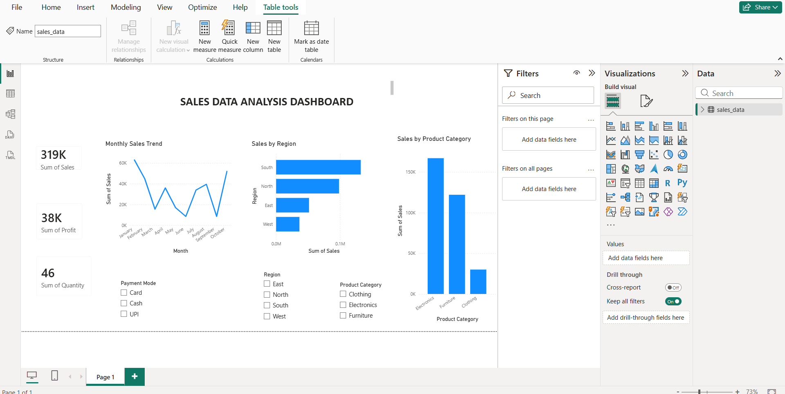
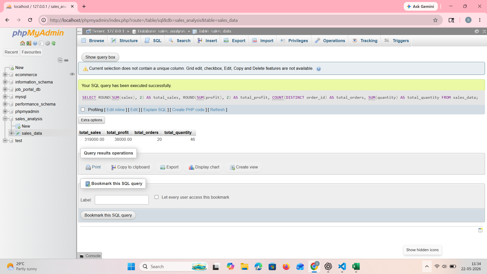
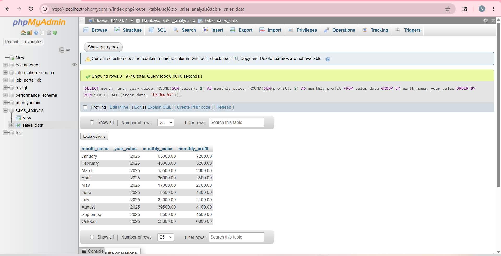
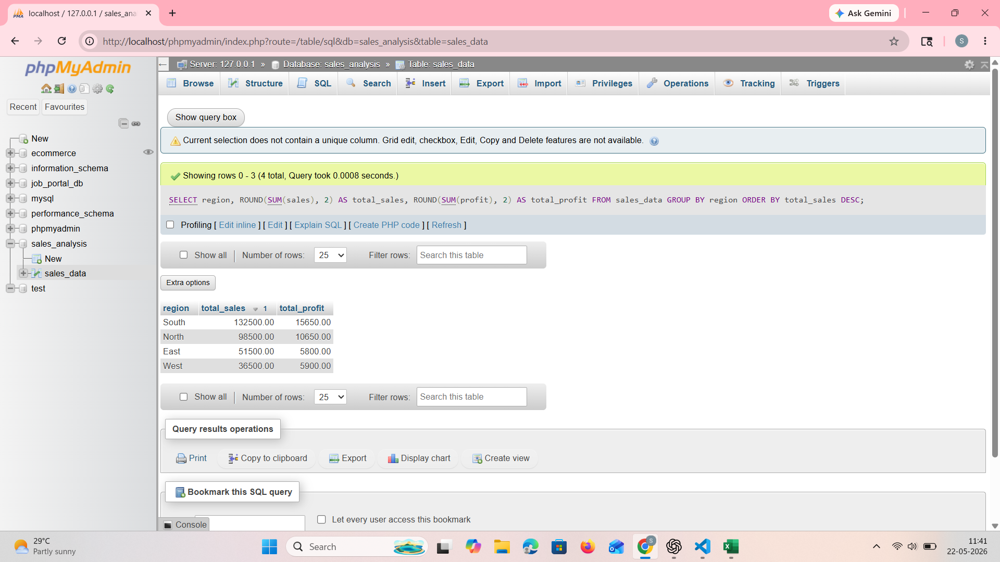
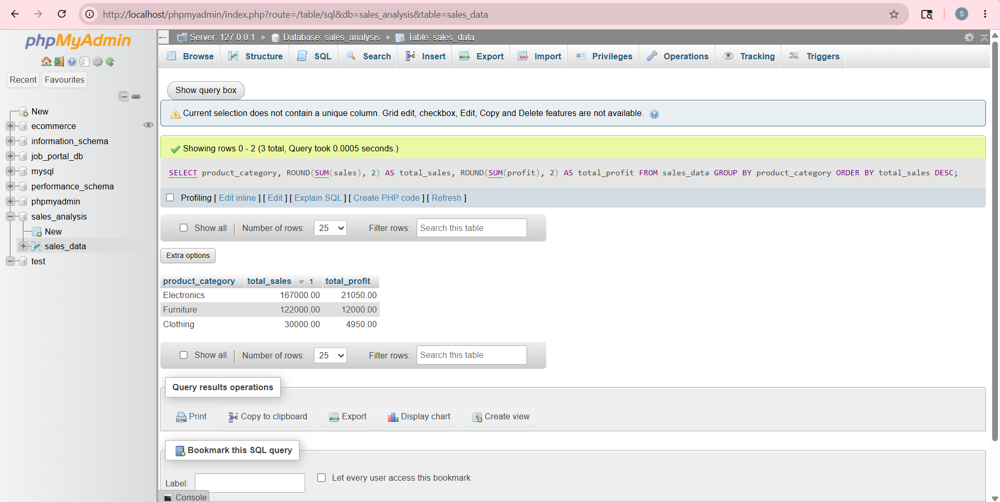
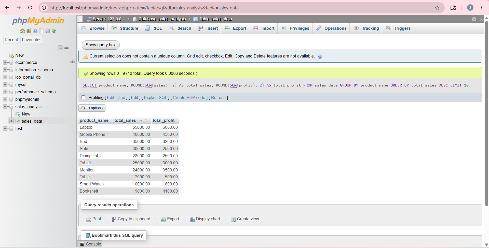

# Sales Data Analysis Dashboard

## Project Overview

The Sales Data Analysis Dashboard is an intermediate-level data analytics project built to analyze sales performance across product categories, regions, payment modes, and monthly trends.

This project uses Excel for data preparation, SQL for data analysis, and Power BI for creating an interactive dashboard. The goal of this project is to understand business performance using key metrics such as total sales, total profit, total quantity sold, regional sales, category-wise sales, and monthly sales trends.

---

## Tools and Technologies Used

- Microsoft Excel
- SQL
- MySQL / phpMyAdmin
- XAMPP
- Power BI
- GitHub

---

## Dataset Details

The dataset contains sales transaction records with the following columns:

- Order ID
- Order Date
- Customer Name
- Region
- State
- City
- Product Category
- Product Name
- Quantity
- Sales
- Discount
- Profit
- Payment Mode
- Month
- Year
- Profit Margin

---

## Key Features

- Cleaned and prepared sales data using Microsoft Excel
- Created additional columns such as Month, Year, and Profit Margin
- Imported the cleaned dataset into MySQL using phpMyAdmin
- Wrote SQL queries to analyze sales performance
- Built an interactive Power BI dashboard
- Added slicers for filtering data by product category, region, and payment mode
- Visualized sales trends, regional sales, category-wise sales, and key performance indicators

---

## Dashboard KPIs

- Total Sales
- Total Profit
- Total Quantity Sold

---

## Dashboard Visuals

- Monthly Sales Trend
- Sales by Region
- Sales by Product Category
- Product Category Filter
- Region Filter
- Payment Mode Filter

---

## SQL Analysis Performed

- Total sales, profit, orders, and quantity
- Monthly sales and profit analysis
- Sales by region
- Sales by product category
- Top products by sales

---

## SQL Queries

### Total Sales, Profit, Orders, and Quantity

```sql
SELECT 
    ROUND(SUM(sales), 2) AS total_sales,
    ROUND(SUM(profit), 2) AS total_profit,
    COUNT(DISTINCT order_id) AS total_orders,
    SUM(quantity) AS total_quantity
FROM sales_data;
```

### Monthly Sales and Profit

```sql
SELECT 
    month_name,
    year_value,
    ROUND(SUM(sales), 2) AS monthly_sales,
    ROUND(SUM(profit), 2) AS monthly_profit
FROM sales_data
GROUP BY month_name, year_value
ORDER BY MIN(STR_TO_DATE(order_date, '%d-%m-%Y'));
```

### Sales by Region

```sql
SELECT 
    region,
    ROUND(SUM(sales), 2) AS total_sales,
    ROUND(SUM(profit), 2) AS total_profit
FROM sales_data
GROUP BY region
ORDER BY total_sales DESC;
```

### Sales by Product Category

```sql
SELECT 
    product_category,
    ROUND(SUM(sales), 2) AS total_sales,
    ROUND(SUM(profit), 2) AS total_profit
FROM sales_data
GROUP BY product_category
ORDER BY total_sales DESC;
```

### Top Products by Sales

```sql
SELECT 
    product_name,
    ROUND(SUM(sales), 2) AS total_sales,
    ROUND(SUM(profit), 2) AS total_profit
FROM sales_data
GROUP BY product_name
ORDER BY total_sales DESC
LIMIT 10;
```

---

## Dashboard Screenshot



---

## SQL Output Screenshots

### Total Sales Summary



### Monthly Sales Analysis



### Sales by Region



### Sales by Category



### Top Products by Sales



---

## Project Structure

```text
Sales-Data-Analysis-Dashboard/
│
├── dataset/
│   └── sales_data.csv
│
├── sql/
│   └── sales_analysis_queries.sql
│
├── dashboard/
│   └── sales_dashboard.pbix
│
├── screenshots/
│   ├── dashboard_home.png
│   ├── sql_total_summary.png
│   ├── sql_monthly_sales.png
│   ├── sql_sales_by_region.png
│   ├── sql_sales_by_category.png
│   └── sql_top_products.png
│
└── README.md
```

---

## Business Insights

- Electronics generated the highest sales among all product categories.
- South region recorded the highest sales performance.
- Monthly sales showed fluctuations across different months.
- UPI, Card, and Cash were used as payment modes.
- Product category and region filters help analyze performance interactively.
- Profit margin analysis helps understand product-level profitability.

---

## Business Recommendations

- Focus more on high-performing regions to increase revenue.
- Improve sales strategies for low-performing regions.
- Increase stock availability for high-selling product categories.
- Monitor discounts to maintain healthy profit margins.
- Use payment mode analysis to understand customer payment preferences.

---

## Learning Outcome

Through this project, I learned how to:

- Clean and prepare sales data using Excel
- Import CSV data into MySQL using phpMyAdmin
- Write SQL queries for business analysis
- Build an interactive dashboard in Power BI
- Create slicers, KPI cards, and charts
- Generate business insights from sales data

---

## Author

**Arshiya Shaik**
